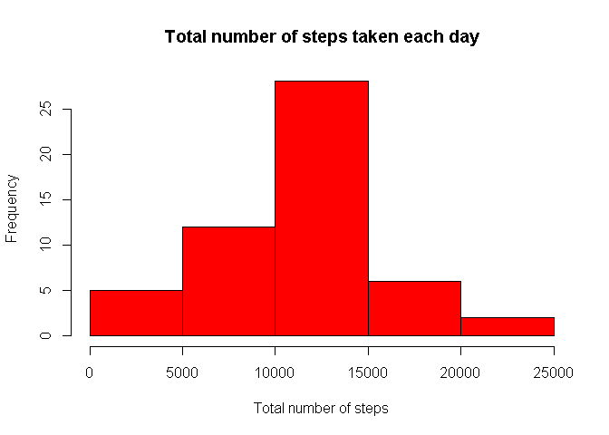
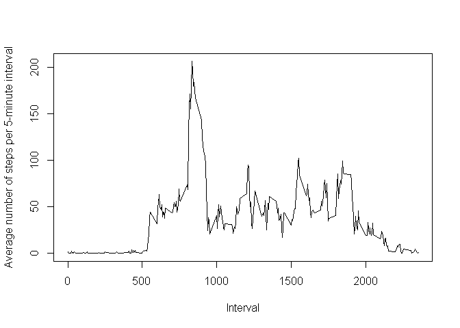
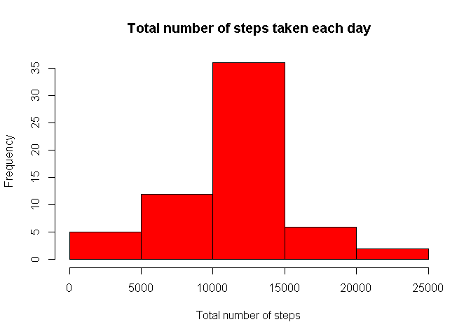
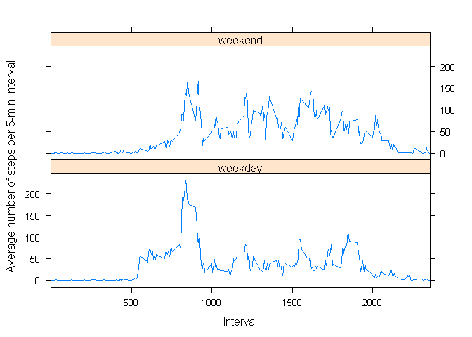

# Reproducible Research - Peer Assessment 1
KelQ  
Saturday, May 16, 2015  


```r
###
## Part 1 - Mean total number of steps taken per day
###

# Sum the number of steps taken each day
temp1 <- aggregate(steps ~ date , activity, sum)

# Plot histogram of total number of steps taken each day
hist(temp1$steps, col="red", main="Total number of steps taken each day", xlab="Total number of steps")
```

 
  
The **mean** of the total number of steps taken each day is 10766.19.  
The **median** of the total number of steps taken each day is 10765.  


```r
###
# Part 2 - Average Daily Activity Pattern
### 

# For each interval, sum the number of steps, and the counts (# of days)
temp1 <- aggregate(steps ~ interval, activity, mean)

# Make the time series plot 
plot(type="l", x=temp1$interval, y=temp1$steps,
     ylab="Average number of steps per 5-minute interval", xlab="Interval", xlim= c(0,2355))
```

 

The **interval, averaged across all days**, that contains the maximum number of steps is 835.  
  

  

```r
### 
# Part 3 
###

# The presence of missing values may introduce bias into calculations or summaries of the data.
# A basic strategy to fill these missing values would be to match the MEAN number of steps 
# for the same interval across all days.
# We have the averaged (mean) data from Part 2 of this assignment (stored in the variable temp1)
# 

# Rename steps column from data frame from Part 2
names(temp1)[2] <- paste("average")

# Left join raw data with data frame from Part 2 (Containing interval and average)
temp3 <- left_join(temper, temp1[,c("interval", "average")], by="interval")

# Matches NA values with value from column - average. 
# Includes rounding the values e.g. 1.57 steps might not make sense
temp3$steps <- ifelse(is.na(temp3$steps), round(temp3$average, 0), temp3$steps)

# Create a dataset that is equal to the original dataset.
temp4 <- temp3[,c("steps", "date", "interval")]

# Sum the number of steps taken each day
temp5 <- aggregate(steps ~ date , temp4, sum)

# Plot histogram of total number of steps taken each day
hist(temp5$steps, col="red", main="Total number of steps taken each day", xlab="Total number of steps")
```

 

The **number of missing values** is 2304.    
  
**NOTE** The estimated values for the missing steps were either rounded up/down to the nearest whole number.  
**NOTE** The final computed mean is rounded to 2 decimal places.  
  
The **mean** of the total number of steps taken each day is 10765.64.  
The **median** of the total number of steps taken each day is 10762.  


```r
###
# Part 4
###

# Create new variable daytype to reflect whether it's weekday or weekend
temp4 <- mutate(temp4, daytype=ifelse(substr(weekdays(as.Date(temp4$date)), 1, 1) == "S",
                                      "weekend", "weekday"))

# For each interval and day type, sum the number of steps
temp5<-aggregate(steps ~ interval + daytype, temp4, mean)

# Make the panel plot using lattice
xyplot(data = temp5, steps ~ interval | daytype, type="l", xlab="Interval",
       ylab="Average number of steps per 5-min interval", layout=c(1,2), xlim=c(0,2355))
```

 

There **are differences** in the activity pattern between weekday and weekend.  
